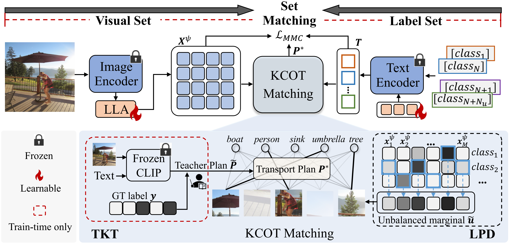

# RAM🚀

Official implementation of the paper in CVPR 2025:

**Recover and Match: Open-Vocabulary Multi-Label Recognition through Knowledge-Constrained Optimal Transport**

RAM is an efficient matching framework for OVMLR (Open-Vocabulary Multi-Label Recognition). To address the ergent problems in existing methods, RAM involves (1) LLA to recover regional semantics, and (2) KCOT to find precise region-to-label matching. The core contribution is the OT-based matching pipeline, which we found does a large good to the OVMLR task while remaining highly efficient.

    

